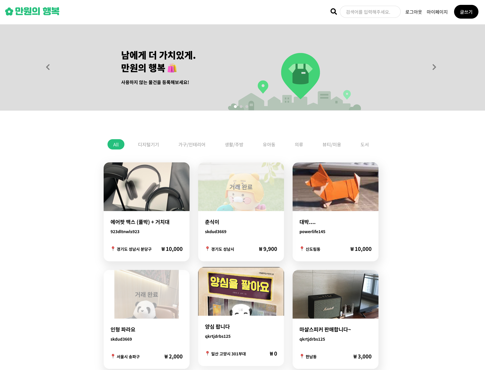
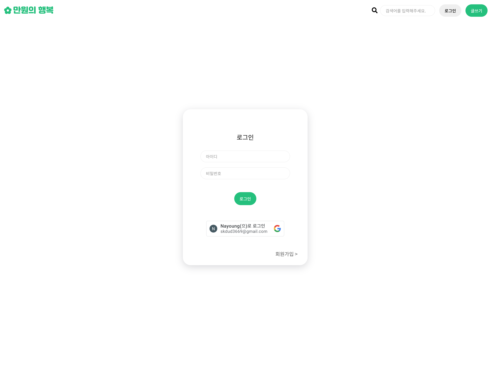
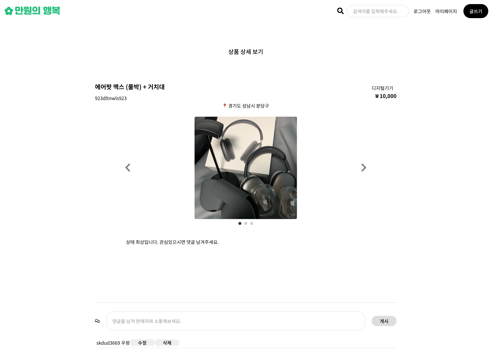
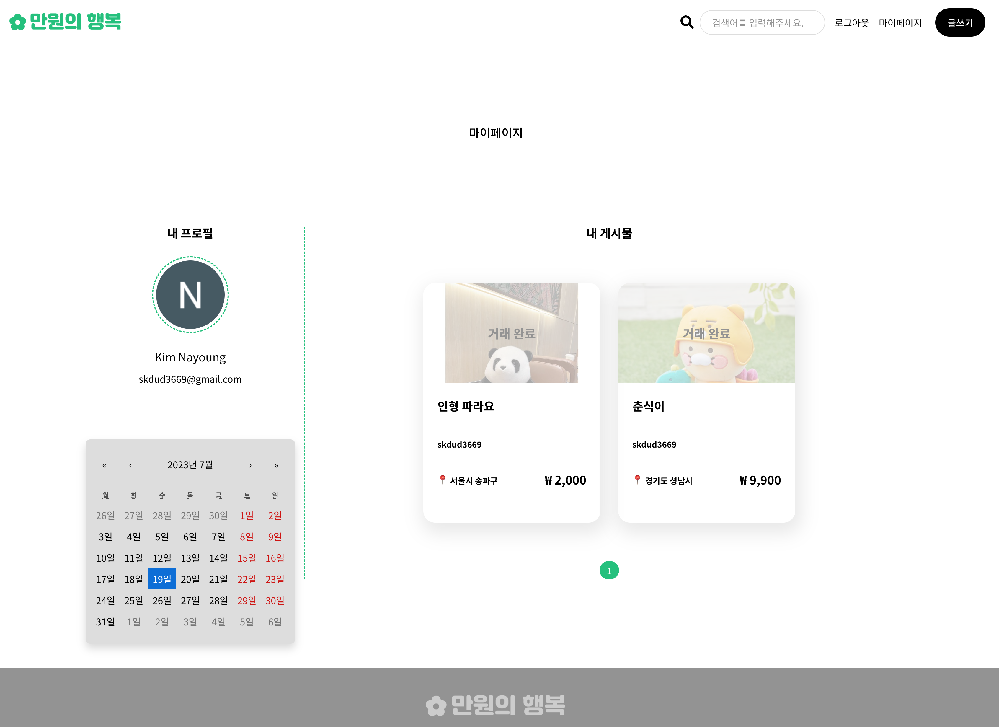
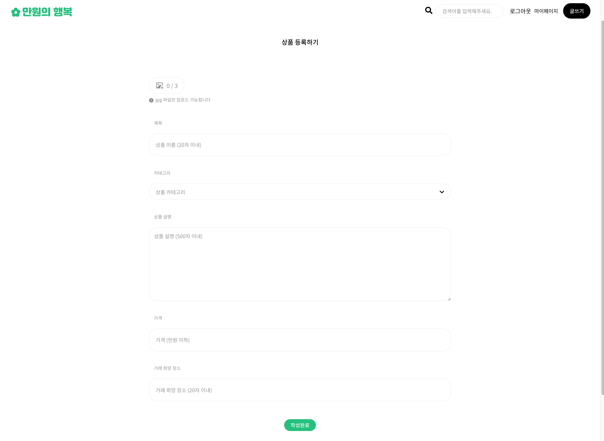

## 주특기 프로젝트 16조

 

#### FE: 김나영, 이수진
#### BE: 권능현, 김기범, 박성균

 

## 🛍️ 프로젝트 소개

- 한줄 요약 : 만원 이하의 중고 물건만을 사고 파는 거래의 장 🛒
- 상세 설명 : 나한테 필요없는 물건일지라도 남에게는 소중할 수 있다는 마인드로, 만원의 행복을 느낄 수 있게 해주는 중고 거래 사이트
- 프로젝트 노션 : <a href="https://www.notion.so/mianayoungkim/S-A-f885c22fdb5740339e6a7fdc9b628ebd">미니프로젝트 S.A</a>

 

> 🔎 프로젝트 배포

- https://second-hand-frontend-pi.vercel.app/

 

> GitHub

- FE : https://github.com/nayoung3669/second-hand-frontend

- BE : https://github.com/NHclub/used-market
   
   

## 📅 프로젝트 기간

- 2023년 7월 14일 ~ 7월 19일

 

## 💻 주요 기능

> 메인페이지

- 

* 배너 슬라이드
* 카테고리별 게시글 조회
* 검색창 (+ 자동완성)
* 게시글 선택 및 조회 기능
* 거래 완료 UI 차별화

 

> 로그인 / 회원가입

- 

* 구글 소셜로그인
* 회원가입 및 로그인 유효성검사

 

> 상세페이지

- 

* 사용자 권한별 UI/UX
* 상품 CRUD
* 댓글 CRUD
* 판매 완료 Toggle 기능

 

> 마이페이지

- 

* 소셜 로그인 내 프로필 조회
* 캘린더
* 내 게시물 조회 및 상세보기

 

> 글 작성 페이지

- 

* 사진 업로드 (AWS S3)
* 유효성검사
* 카테고리 설정

 
 

## ⚙ 기술스택 및 라이브러리

- FE
  - react-redux, redux-toolkit, react-oauth/google, axios, jwt-decode, styled-component, react-tostify, sweetalert2, aws-sdk
     
     
- BE
  - Spring Boot- data-jpa, thymeleaf, web, tomcat, lombok
